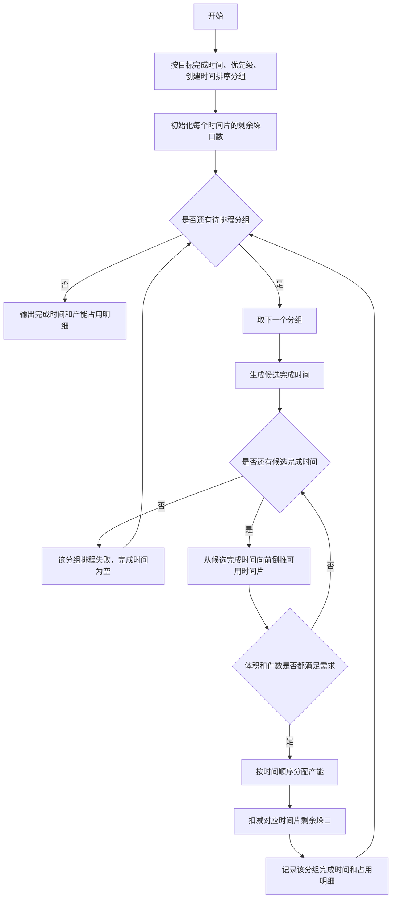

# ESD 发货排程算法说明

本文说明 `local-dispatch/src/algo/esd_schedule.py` 中的 ESD 发货排程算法，面向业务理解，省略代码实现细节。

## 输入

算法输入是一批待排程分组和一组按时间片配置的发货产能。

### 分组信息

每个分组表示一批需要安排装车的货量，包含：

- 分组 ID：用于标识该分组。
- 最早可装车时间：该分组不能早于这个时间开始占用产能。
- 目标完成时间：业务期望该分组尽量在这个时间点完成装车。
- 体积和件数：该分组需要消耗的总发货能力。
- 优先级：数字越小，优先级越高。
- 创建时间：同等条件下，创建更早的分组优先安排。

### 发货产能

发货产能按固定时间片给出，例如每 30 分钟一个时间片。每个时间片包含：

- 每个垛口可处理的体积。
- 每个垛口可处理的件数。
- 当前时间片可用的垛口数量。

## 输出

算法输出两类结果：

- 每个分组的预计装车完成时间。
  - 如果成功排上，返回完成时间点。
  - 如果没有足够连续可用产能，返回空。
- 每个分组在各时间片占用的产能明细。
  - 包括占用的时间片、体积、件数和垛口数。

## 算法逻辑

### 1. 分组排序

算法先对所有分组排序，决定排程顺序：

1. 目标完成时间更早的分组优先。
2. 目标完成时间相同时，优先级数字更小的分组优先。
3. 仍然相同时，创建时间更早的分组优先。

### 2. 初始化可用产能

算法把每个时间片的垛口数记录为“剩余可用垛口数”。

每成功安排一个分组，就会从对应时间片扣减 1 个垛口，避免多个分组超量占用同一个时间片。

### 3. 为每个分组选择完成时间

对每个分组，算法会尝试寻找一个合适的完成时间：

1. 优先尝试不晚于目标完成时间的方案。
   - 从目标完成时间开始，逐步向前尝试。
   - 目的是尽量让分组按目标时间或更早完成。
2. 如果目标时间前无法安排，再尝试目标时间之后的方案。
   - 从目标完成时间之后开始，逐步向后尝试。
   - 目的是在无法准时完成时，尽量安排一个最早的延后完成时间。

### 4. 检查某个完成时间是否可行

对于一个候选完成时间，算法会从该时间点向前倒推，寻找可用时间片：

1. 不能早于该分组的最早可装车时间。
2. 已经没有剩余垛口的时间片会被跳过。
3. 每找到一个可用时间片，就累计该时间片一个垛口可提供的体积和件数。
4. 当累计体积和累计件数都满足分组需求时，认为该候选完成时间可行。
5. 如果倒推到最早可装车时间仍不满足需求，则该候选完成时间不可行。

### 5. 确认分配并扣减产能

候选完成时间可行后，算法会按时间顺序正式分配产能：

1. 从找到的开始时间到候选完成时间依次检查。
2. 对有剩余垛口的时间片，占用 1 个垛口。
3. 按分组剩余需求扣减体积和件数，直到该分组需求被满足。
4. 写入该分组的产能占用明细。
5. 同步扣减对应时间片的剩余垛口数。

### 6. 排程失败处理

如果一个分组在所有候选完成时间下都找不到可行方案，则该分组排程失败：

- 完成时间记为空。
- 产能占用明细为空。
- 算法继续安排后续分组。

## 流程图

